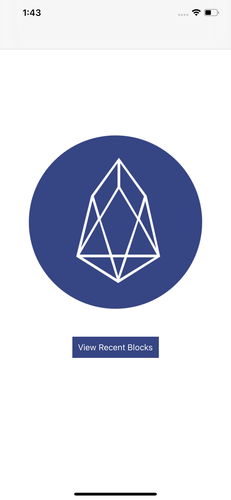
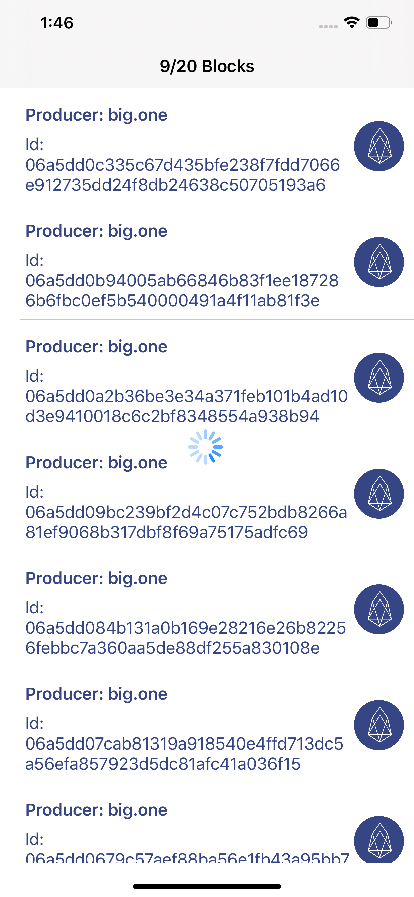
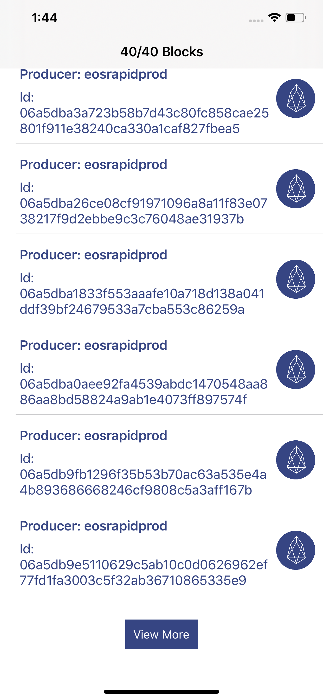
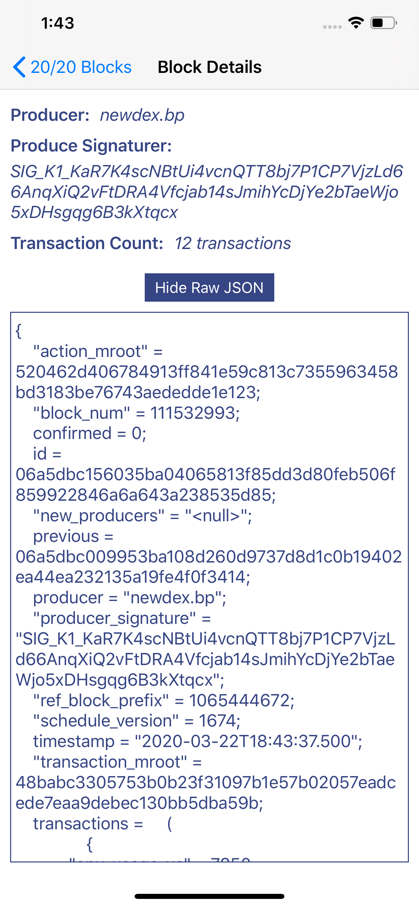
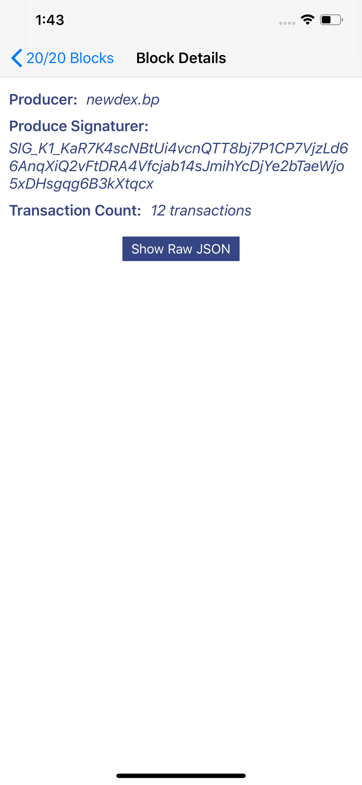

# Blockchain EOS Example App

## Overview
This is an example app that hits the Block.One EOS APIs.

## Features:
- View 20 Recent Blocks Inititally
- Pull to Refresh the data to be up to date
- Load More if you want to view more than 20 blocks

## Testing:
- Open Constants.swift file and set the `EosNodeEndpoint`

## Screenshots
| Initial | 20 Recents |
|-----------------------------------------------------|:-------------|
|        ||

| Load More                                           | Pull to Refresh | 
|-----------------------------------------------------|:-------------|
|  |  |

| Block Details with Raw JSON hidden | Block Details with Raw JSON displaying 
|-------------------------------------------------------|:-------------|
|  |  | 

