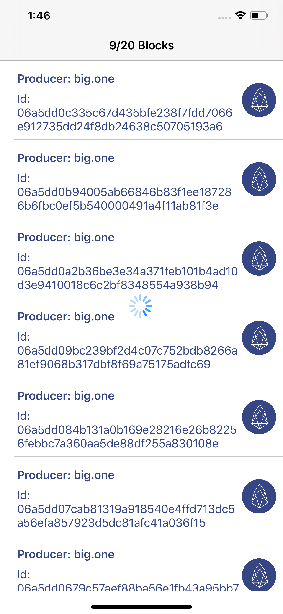
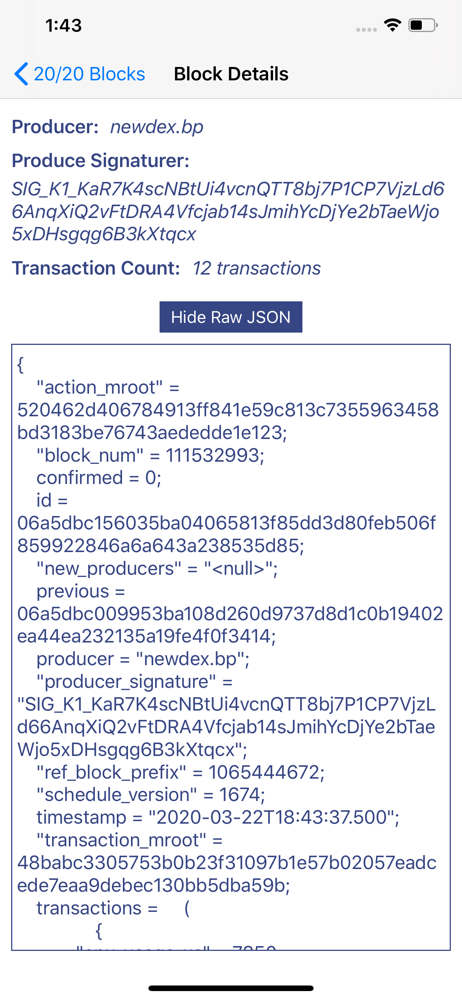

# Blockchain EOS Example App

## Overview
This is an example app that hits the Block.One EOS APIs.

## Features:
- View 20 Recent Blocks Inititally
- Pull to Refresh the data to be up to date
- Load More if you want to view more than 20 blocks

## Testing:
- Open Constants.swift file and set the `EosNodeEndpoint`

## Screenshots
| Screen           | Screenshot
| -------------    |:-------------:|
| Initial Screen   |  |
| 20 Recent Blocks   |  |
| Load More  |  |
| Block Details with Raw JSON displaying  |  |
| Block Details with Raw JSON hidden   |  |

